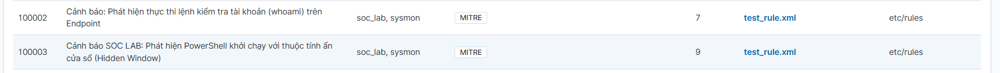
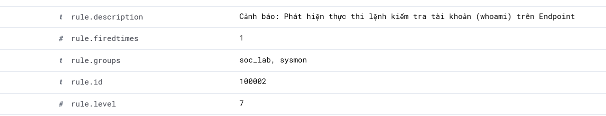
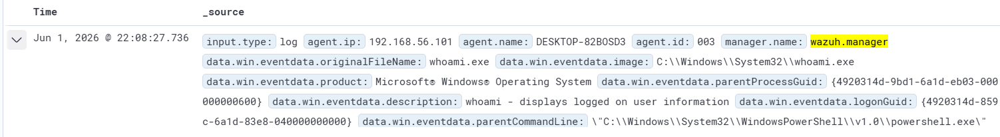
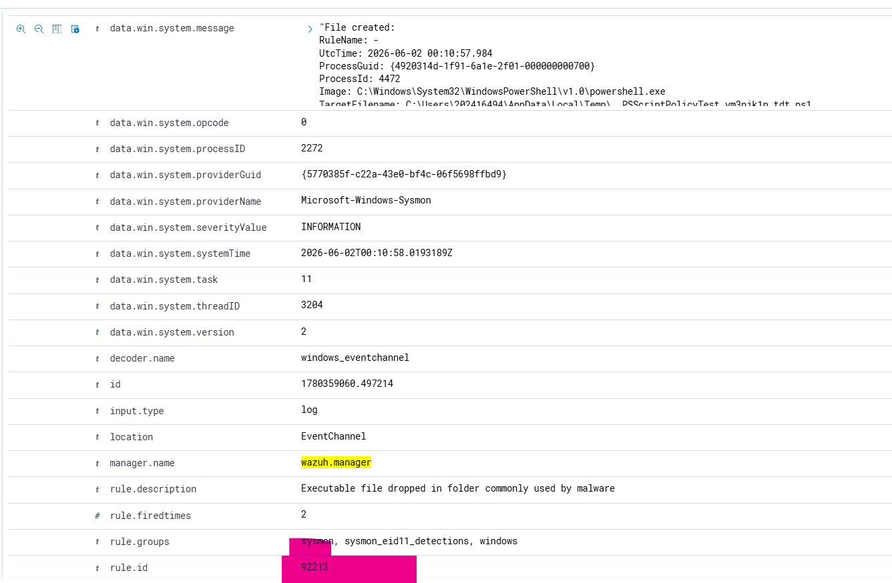
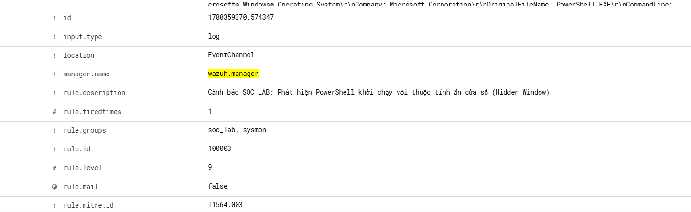
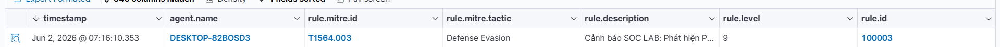
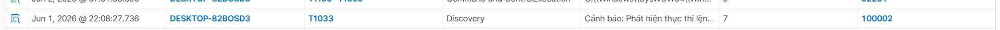

# Phase 2 - Sysmon Integration & Custom Detection Engineering

## Overview

Sau khi hoàn thành việc triển khai Wazuh SIEM và kết nối thành công Windows Endpoint ở Phase 1, mục tiêu của Phase 2 là mở rộng khả năng quan sát (Visibility) của hệ thống bằng cách tích hợp Sysmon và xây dựng các luật phát hiện hành vi đáng ngờ trên Endpoint.

Lab này tập trung vào:

* Thu thập Sysmon Event Logs từ Windows Endpoint.
* Chuyển tiếp telemetry tới Wazuh Manager.
* Xây dựng Custom Detection Rules.
* Tinh chỉnh cảnh báo để giảm trùng lặp và tăng độ chính xác.
* Mapping cảnh báo với MITRE ATT&CK Framework.

---

# Objective

Triển khai hệ thống giám sát nâng cao cho Windows Endpoint bằng Sysmon nhằm phát hiện các hành vi thực thi lệnh đáng ngờ và thử nghiệm quy trình Detection Engineering trên Wazuh.

---

# Telemetry Flow Architecture

Luồng dữ liệu trong hệ thống được thiết kế như sau:

```text
Windows Endpoint
      │
      ▼
    Sysmon
(Event Viewer)
      │
      ▼
Wazuh Agent
(ossec.conf)
      │
      ▼
Wazuh Manager
(Decoder + Rules Engine)
      │
      ▼
   Filebeat
      │
      ▼
Wazuh Indexer
      │
      ▼
  Dashboard
```

Sysmon chịu trách nhiệm tạo ra các sự kiện hệ thống chi tiết như Process Creation, Network Connection và File Creation. Wazuh Agent thu thập các sự kiện này thông qua Windows Event Channel và gửi về Wazuh Manager để phân tích.

---

# Sysmon Deployment

## Installing Sysmon

Trên Windows Endpoint, Sysmon được cài đặt để tăng cường khả năng ghi nhận hoạt động của hệ điều hành.

Ví dụ cài đặt:

```powershell
sysmon64.exe -accepteula -i sysmonconfig.xml
```

Sau khi cài đặt thành công, Sysmon tạo Event Log riêng:

```text
Applications and Services Logs
└── Microsoft
    └── Windows
        └── Sysmon
            └── Operational
```

---

# Wazuh Agent Configuration

Để thu thập Sysmon logs, bổ sung cấu hình trong file:

```text
C:\Program Files (x86)\ossec-agent\ossec.conf
```

Ví dụ:

```xml
<localfile>
  <location>Microsoft-Windows-Sysmon/Operational</location>
  <log_format>eventchannel</log_format>
</localfile>
```

## Why EventChannel?

Thay vì sử dụng định dạng `eventlog`, Wazuh được cấu hình sử dụng `eventchannel`.

Lý do:

* Hỗ trợ đầy đủ XML Event Data.
* Giữ nguyên các trường dữ liệu gốc.
* Tăng khả năng parsing và rule matching.
* Phù hợp với Sysmon Event IDs.

---

# Custom Detection Rules

Mục tiêu của phần này là phát hiện các hành vi thực thi lệnh đáng chú ý trên Endpoint.

Custom Rules được triển khai trong:

```text
/var/ossec/etc/rules/test_rules.xml
```

---

# Attack Simulation & Detection Validation

## Case 1 – Detecting whoami Execution

### Attack Simulation

Trên Windows Endpoint:

```cmd
whoami
```

### Detection Logic

Rule tùy chỉnh được cấu hình để phát hiện tiến trình:

```text
whoami.exe
```

### Result

Wazuh sinh cảnh báo:

```text
Alert ID: 100002
```

Thông tin ghi nhận:

* User thực thi
* Command Line
* Process Name
* Timestamp

Kết quả xác nhận Sysmon Event ID 1 đã được thu thập và phân tích thành công.

---

## Case 2 – Detecting Certutil Execution

### Attack Simulation

Thực thi:

```cmd
powershell.exe -WindowStyle Hidden -Command "echo 'SOC Lab Test'"
```

Khởi chạy PowerShell ẩn ngầm (Hidden Window) (Mã kỹ thuật MITRE ATT&CK: T1564.003)

---

# Rule Overlapping Analysis

Trong quá trình kiểm thử, phát hiện Wazuh đã có Rule mặc định:

```text
Rule ID: 92213
```

Rule này cũng phát hiện hành vi liên quan tới `powershell.exe`.

Khi tạo rule mới trực tiếp, hệ thống sinh ra nhiều cảnh báo có nội dung tương tự, gây trùng lặp (Rule Overlapping).

---

# Alert Tuning

Để tránh sửa đổi rule mặc định của hệ thống, phương pháp kế thừa được áp dụng thông qua:

```xml
<if_sid>92213</if_sid>
```

Ví dụ:

```xml
<rule id="100003" level="9">
    <if_sid>61603</if_sid> <!-- Check Sysmon Event ID 1 -->
    <field name="win.eventdata.image">powershell.exe</field>
    <field name="win.eventdata.commandLine" type="pcre2">(?i)-WindowStyle\s+Hidden</field>
    <description>Cảnh báo SOC LAB: Phát hiện PowerShell khởi chạy với thuộc tính ẩn cửa sổ (Hidden Window)</description>
    <mitre>
      <id>T1564.003</id>
    </mitre>
  </rule>
```

Lợi ích:

* Không chỉnh sửa rule gốc.
* Dễ bảo trì khi nâng cấp Wazuh.
* Tăng mức độ ưu tiên của cảnh báo.
* Bổ sung ATT&CK Mapping.

Kết quả:


---

# Results

Sau quá trình triển khai:

* Sysmon logs được thu thập thành công.
* Sysmon Event ID 1 xuất hiện trên Dashboard.
* Rule phát hiện `whoami.exe` hoạt động chính xác.
* Rule phát hiện `powershell.exe` hoạt động chính xác.
* Cơ chế kế thừa `<if_sid>` loại bỏ vấn đề Rule Overlapping.
* MITRE ATT&CK Mapping hiển thị chính xác trên Dashboard.




---

# Lessons Learned

Thông qua bài lab này, một số bài học quan trọng được rút ra:

* Sysmon cung cấp khả năng quan sát Endpoint vượt xa Windows Event Log mặc định.
* Chất lượng Detection phụ thuộc nhiều vào việc xây dựng và tinh chỉnh Rule.
* Rule Overlapping là vấn đề phổ biến trong Detection Engineering.
* Sử dụng cơ chế kế thừa `<if_sid>` giúp mở rộng khả năng phát hiện mà vẫn bảo toàn các rule mặc định của Wazuh.
* Việc Mapping với MITRE ATT&CK giúp chuẩn hóa cảnh báo theo ngôn ngữ chung của ngành Cybersecurity.
