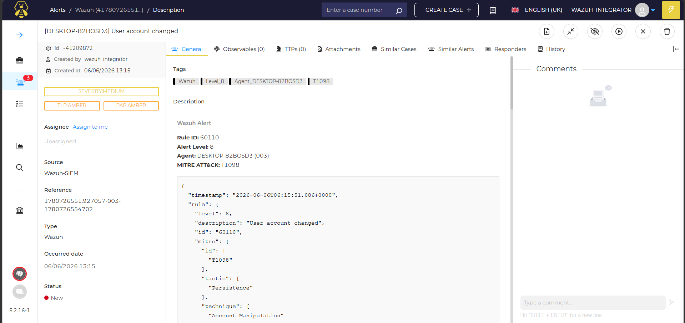
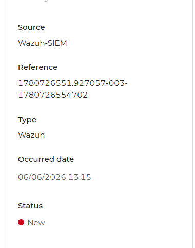
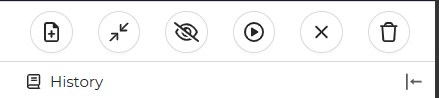
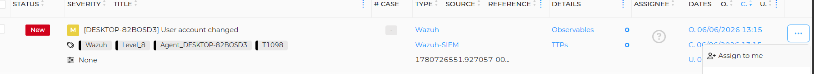
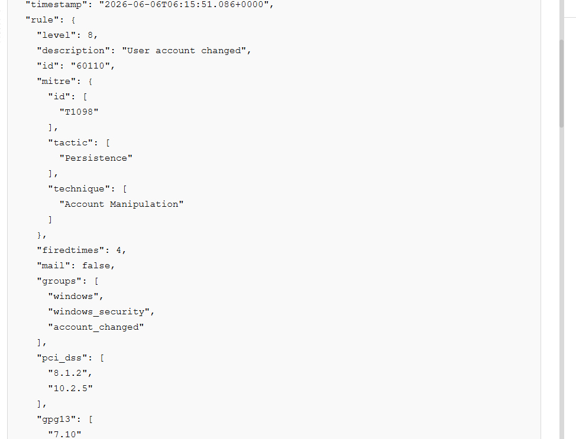
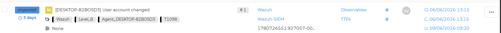
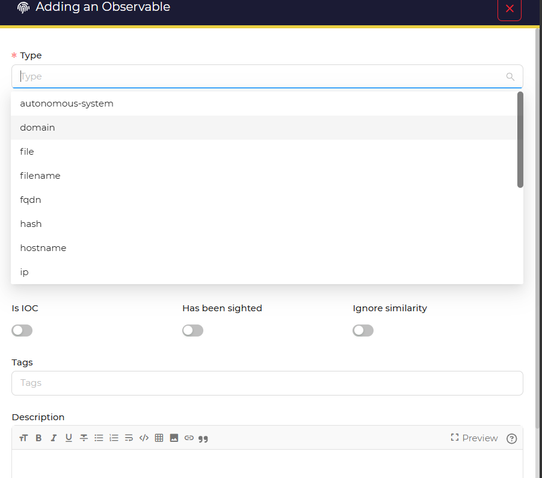
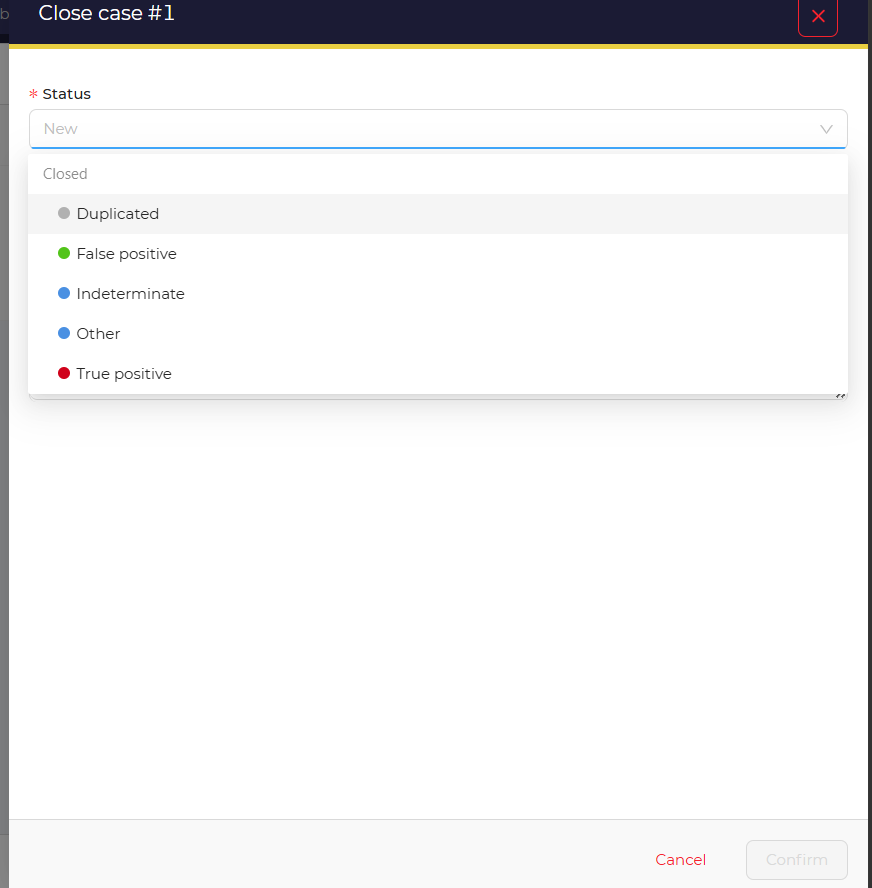
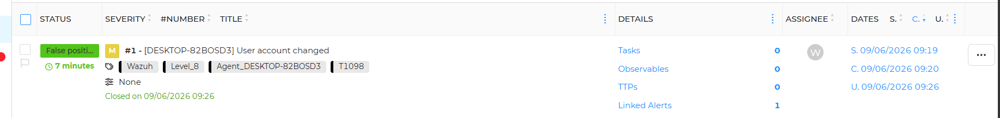

# TheHive 5 Operations Guide: Alert Classification & Incident Handling

## 1. Understanding Security Operations Indicators (TLP & PAP)

Ngay bên dưới trường **Severity** trong giao diện Alert của TheHive, có hai nhãn phân loại quan trọng:

```text
TLP: AMBER
PAP: AMBER
```

Đây là hai tiêu chuẩn được sử dụng rộng rãi trong hoạt động SOC để kiểm soát việc chia sẻ thông tin và các hành động được phép thực hiện trong quá trình điều tra.

---

## TLP (Traffic Light Protocol)

TLP quy định:

> "Thông tin này được phép chia sẻ cho ai?"

Mục đích là ngăn chặn việc rò rỉ thông tin nhạy cảm trong quá trình xử lý sự cố.

### TLP:AMBER

Thông tin chỉ được phép chia sẻ:

- Trong nội bộ tổ chức.
- Với đội SOC.
- Bộ phận IT.
- Ban quản lý liên quan.
- Đối tác trực tiếp cần biết để tự bảo vệ.

Không được:

- Đăng tải lên diễn đàn công cộng.
- Chia sẻ cho bên thứ ba không có thẩm quyền.
- Công khai trên mạng xã hội hoặc các nền tảng cộng đồng.

> 

---

## PAP (Permissible Actions Protocol)

PAP quy định:

> "Bạn được phép thực hiện những hành động điều tra nào mà không làm lộ việc phát hiện cho đối tượng tấn công?"

### PAP:AMBER

Được phép:

- Điều tra nội bộ.
- Thu thập IOC.
- Tra cứu bằng công cụ nội bộ.
- Phân tích offline.

Không nên:

- Tải file nghi ngờ lên các dịch vụ công khai.
- Tương tác trực tiếp với hạ tầng của đối tượng tấn công.

### Ví dụ thực tế

Nếu thu được một file đáng ngờ từ máy nạn nhân:

 Không nên:

```text
Upload trực tiếp file lên VirusTotal Public
```

vì đối tượng tấn công có thể theo dõi các mẫu mới được gửi lên hệ thống.

 Nên:

```text
Kiểm tra Hash
Phân tích Sandbox nội bộ
Quét bằng công cụ doanh nghiệp
```

---

# 2. Alert Lifecycle in TheHive

Khi Alert được gửi từ Wazuh sang TheHive, trạng thái mặc định sẽ là:

```text
Status: New
```

Điều này có nghĩa:

```text
Alert đã được tiếp nhận nhưng chưa được xử lý.
```

> 

---

## Alert vs Case

Trong quy trình SOC:

```text
Alert ≠ Incident
```

Một Alert chỉ là dấu hiệu bất thường.

Để bắt đầu điều tra chính thức, Analyst sẽ:

```text
Promote Alert → Case
```

thay vì chỉnh sửa thủ công trạng thái Alert.

---

# 3. Alert Action Buttons

Ở góc trên bên phải của Alert, TheHive cung cấp một số hành động quan trọng.

| Icon | Function | Purpose |
|--------|----------|----------|
| 📁➕ | Import Alert / Create Case | Chuyển Alert thành Incident Case |
| ↗️ | Merge | Gộp các alert đã chọn thành 1 case |
| 👁️ | Mark as Read / Dismiss | Đánh dấu đã đọc hoặc bỏ qua |
| ▶️ | Run Responders | Kích hoạt Playbook tự động |

> 

---

## Create Case

Nút quan trọng nhất trong quá trình điều tra.

```text
Alert
    ↓
Create Case
    ↓
Investigation Workspace
```

Sau khi bấm:

```text
📁+
```

TheHive sẽ tạo một Case mới để phục vụ điều tra.

---

---

## Mark as Read / Dismiss

Sử dụng khi xác định:

```text
False Positive
```

hoặc

```text
Benign Activity
```

không cần điều tra thêm.

---

## Run Responders

Kích hoạt các Playbook tự động.

Ví dụ:

- Block IP.
- Isolate Endpoint.
- Disable User.
- Notify SOC Team.

---

# 4. Alert Triage Procedure

Ví dụ xử lý một Alert từ Wazuh theo quy trình chuẩn SOC.

---

## Step 1 - Assign Ownership

Trong menu bên trái:

```text
Assign to me
```

Mục đích:

```text
Tôi đang xử lý Alert này.
```

Giúp tránh việc nhiều Analyst cùng điều tra một sự cố.

> 

---

## Step 2 - Review Raw Event Data

Mở tab:

```text
General
```

Phân tích:

- Rule ID
- Alert Level
- MITRE ATT&CK
- Hostname
- User Account
- Command Line

Ví dụ:

```text
Rule ID: 60110
```

MITRE:

```text
Persistence
```

Điều này cho thấy đối tượng có thể đang cố duy trì quyền truy cập trên hệ thống.

---


> 

---

## Step 3 - Promote Alert to Case

Bấm:

```text
📁+
```

Chọn:

```text
Create Empty Case
```

hoặc

```text
Use Existing Template
```

Sau khi thực hiện:

```text
Alert
    ↓
Case
```

Trạng thái sẽ chuyển sang:

```text
Import
```

```

> 

---

## Step 4 - Investigation & Response

Trong Case Workspace có thể:

### Add Tasks

Ví dụ:

```text
[ ] Verify user activity
[ ] Reset compromised password
[ ] Isolate affected endpoint
[ ] Review additional logs
```

---

### Add Observables

Ví dụ:

```text
Hostname
Username
IP Address
Domain
Hash
File Name
```

---

---

# 5. Case Closure

Sau khi hoàn thành điều tra:

## True Positive

```text
Incident Confirmed
```

Các hành động khắc phục đã được thực hiện.

---

## False Positive

```text
Legitimate Administrative Activity
```

Không phát hiện hành vi độc hại.

---

## Resolved

Case được đóng với đầy đủ:

- Timeline
- Tasks
- Observables
- Analyst Notes

> 
> 

---

# Conclusion

TheHive không chỉ là nơi hiển thị Alert mà còn đóng vai trò là nền tảng quản lý vòng đời sự cố (Incident Lifecycle Management).

Quy trình chuẩn bao gồm:

```text
Alert
    ↓
Assign
    ↓
Triage
    ↓
Create Case
    ↓
Investigation
    ↓
Response
    ↓
Closure
```

Việc tuân thủ quy trình này giúp đội ngũ SOC:

- Tránh bỏ sót sự cố.
- Theo dõi tiến độ xử lý.
- Chuẩn hóa quy trình điều tra.
- Lưu trữ đầy đủ bằng chứng phục vụ kiểm toán và forensics.