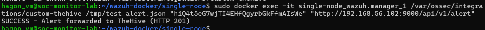
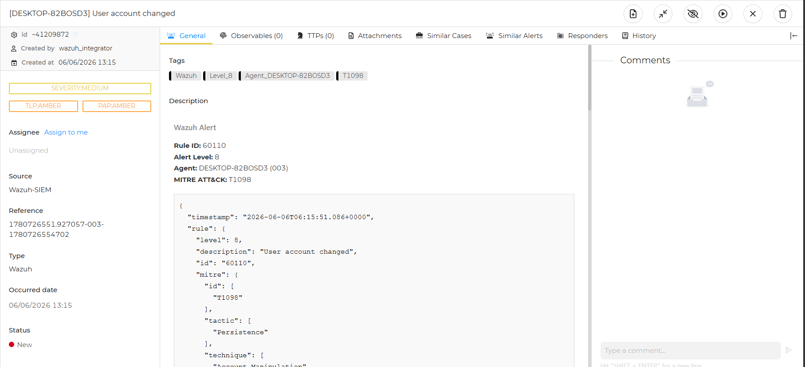

# Integrating Wazuh SIEM with TheHive 5 SOAR

## Overview

Sau khi hoàn thành việc triển khai Wazuh SIEM, tích hợp Sysmon, xây dựng các Custom Detection Rules và mở rộng khả năng giám sát đa nền tảng, mục tiêu của Phase này là đưa hệ thống tiến thêm một bước từ **Detection** sang **Incident Management** bằng cách tích hợp Wazuh với TheHive 5 SOAR.

Thông qua Phase này, các cảnh báo sinh ra từ Wazuh sẽ được tự động chuyển thành Alert trong TheHive, tạo nền tảng cho quy trình điều tra và xử lý sự cố theo mô hình SOC thực tế.

---

# Lab Topology

## Infrastructure Components

### SIEM / SOAR Server

* Ubuntu Server
* Wazuh Manager
* Wazuh Dashboard
* TheHive 5 Community Edition
* Docker Environment

### Endpoint

* Windows 10 Enterprise
* Wazuh Agent

### Network

* VirtualBox Host-Only Adapter
* Internal Communication Network

---

## Architecture Flow

```text
Windows Endpoint
        │
        ▼
   Wazuh Agent
        │
        ▼
   Wazuh Manager
        │
        ▼
 Integration Script
(custom-thehive)
        │
        ▼
    TheHive API
        │
        ▼
  TheHive Alert
        │
        ▼
 Incident Case
```

---

# Technical Challenges & Solutions

Trong quá trình triển khai tích hợp Wazuh và TheHive, hệ thống gặp hai vấn đề chính liên quan đến cơ chế thực thi Integration Script và mô hình phân quyền của TheHive 5.

---

# Issue 1 - Integration Script Not Executing

## Symptoms

Wazuh Manager không kích hoạt được script tích hợp TheHive.

File:

```text
/var/ossec/logs/integrations.log
```

không ghi nhận bất kỳ request nào gửi tới TheHive API.

---

## Root Cause

Trong thư mục:

```text
/var/ossec/integrations/
```

tồn tại hai file:

```text
custom-thehive
custom-thehive.py
```

Wazuh ưu tiên thực thi file không có đuôi mở rộng, dẫn đến việc script Python chính không được gọi đúng cách.

Ngoài ra, file chưa được cấp quyền thực thi phù hợp cho nhóm `wazuh`.

---

## Resolution

Xóa file dư thừa:

```bash
rm -f /var/ossec/integrations/custom-thehive
```

Tạo lại file thực thi:

```bash
cp /var/ossec/integrations/custom-thehive.py \
/var/ossec/integrations/custom-thehive
```

Cấp quyền:

```bash
chmod 750 /var/ossec/integrations/custom-thehive*
chown root:wazuh /var/ossec/integrations/custom-thehive*
```

---

## Verification

Kiểm tra:

```bash
ls -l /var/ossec/integrations/
```

Đảm bảo file script có owner, group và execute permission chính xác.


---

# Issue 2 - HTTP 403 Forbidden

## Symptoms

Khi gửi Alert thử nghiệm tới TheHive:

```text
FAILED - HTTP 403:
You are not authorized to [Create Alert]
```

---

## Root Cause

TheHive 5 sử dụng mô hình phân quyền theo Organization.

Trong môi trường mặc định:

```text
admin
```

không được sử dụng để lưu trữ Alert hoặc Case nghiệp vụ.

Ngoài ra, API User thuộc nhiều Organization khiến TheHive không xác định chính xác Context xử lý request.

---

## Resolution

### Step 1 - Create Dedicated Organization

Tạo Organization riêng:

```text
wazuh_integrator
```

---

### Step 2 - Configure API User

Thiết lập:

```text
Role: org-admin
Default Organization: wazuh_integrator
```

---

### Step 3 - Force Organization Context

Bổ sung Header:

```python
headers = {
    "Authorization": "Bearer " + api_key,
    "Content-Type": "application/json",
    "X-TheHive-Organization": "wazuh_integrator"
}
```

Header này giúp TheHive xác định chính xác Organization xử lý Alert.

---

## Verification

Gửi thử một Alert thông qua API.

Yêu cầu:

```text
HTTP 201 Created
```

hoặc

```text
Alert successfully created
```

> 

---

# Final Verification Test

Sau khi hoàn thành cấu hình, tiến hành kiểm thử end-to-end từ Endpoint tới TheHive.

---

## Step 1 - Generate Security Event

Trên Windows Endpoint:

```powershell
net user attack_test 1 Pass123456 /add
```

Mô phỏng kỹ thuật:

```text
MITRE ATT&CK
T1098 - User Account Change
```

---

## Step 3 - Validate Alert in TheHive

Đăng nhập:

```text
Organization:
wazuh_integrator
```

Đi tới:

```text
Alerts
```

Kết quả mong đợi:

* Alert mới được tạo tự động.
* Status = New.
* Alert chứa đầy đủ thông tin từ Wazuh.

Ví dụ:

```text
Title:
Scheduled Task Created

Host:
DESKTOP...

Severity:
Medium

MITRE:
T1098
```

> 

---

# Results

Sau khi hoàn thành tích hợp:

* Wazuh tự động gửi Alert tới TheHive.
* API Authentication hoạt động chính xác.
* Context Organization được xử lý đúng.
* Alert được tạo thành công trong TheHive.
* Analyst có thể chuyển Alert thành Incident Case để điều tra.

---

# Lessons Learned

## 1. Detection Is Only The Beginning

Wazuh chịu trách nhiệm phát hiện hành vi bất thường, nhưng cảnh báo chỉ là điểm khởi đầu của quy trình SOC.

---

## 2. Case Management Matters

TheHive cung cấp cơ chế quản lý Alert và Incident tập trung, giúp Analyst:

* Theo dõi tiến độ xử lý.
* Phân công trách nhiệm.
* Lưu trữ kết quả điều tra.

---

## 3. API Context Is Critical

Trong TheHive 5, việc cấu hình Organization và API Context đóng vai trò quan trọng không kém Authentication.

Sai Organization có thể dẫn đến lỗi:

```text
HTTP 403 Forbidden
```

mặc dù API Key vẫn hợp lệ.

---

## 4. End-to-End Validation

Một bộ tích hợp chỉ được xem là hoàn thành khi xác minh thành công toàn bộ luồng:

```text
Endpoint
    ↓
Wazuh Agent
    ↓
Wazuh Manager
    ↓
Integration Script
    ↓
TheHive API
    ↓
TheHive Alert
```

và Alert xuất hiện chính xác trên giao diện làm việc của Analyst.
